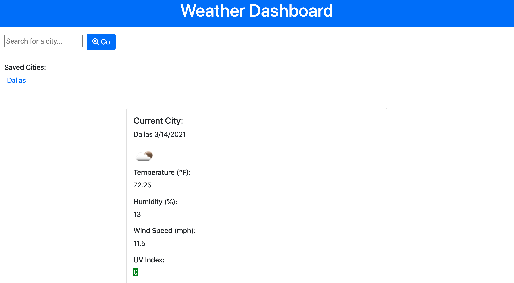

# Wonderful Weather App

## Purpose/Description

This application was created to display the current weather (including temperature, wind speed, humidity, and UV index) in a given city, plus a five-day forecast for the same city. Searched cities are stored in a list on the left of the user's screen, so that the user can return to and view the weather for that city again later. Useful for travelers, or anyone who is curious about the weather. 

## Built With

HTML, CSS, and JavaScript

## Website

https://jessicap5159.github.io/wonderfulweatherapp/

## Credits
THANK YOU to John Baxter, Artur Markov, Megan Close, Mason McGinley, Shelby Jordan, Roosevelt Jointer, and Aaron Quach; also openweathermap.org, digitalocean.com, stackoverflow.com, bulletpointsymbol.com, and w3schools.com.

## License

https://www.gnu.org/licenses/gpl-3.0.html